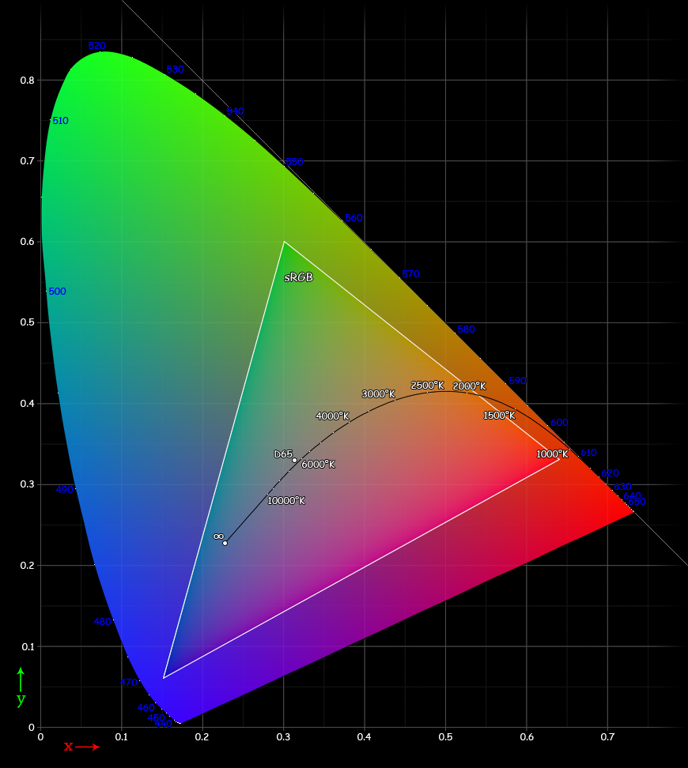
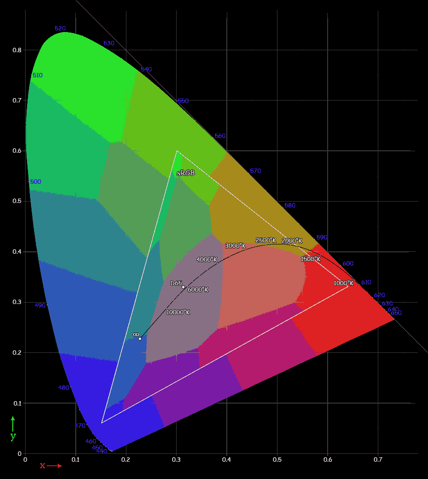

# kmean-image-compresion

Simple implementation of the Image Compression algorithm based on KMeans clustering;

Each pixel in the image has 3 colors. (or 4 - transarept colors). We treat this data as coordinate space x,y,z;
That new xyz space will have set clouds of data (pixels) whice if forming a clusters. for example the balck and white image with one red elemente (rose) will be presented as cloud with lot of pixesl that lies in the middle line of that 3d cube  - basecase graysclase pixel has same values for RGB like 128,128,128. and will have blob of pixels in the RED corner. (128,0,0) 

Most expressive example is the sRGB space image:

We see full pallete of colors.

Once we apply the 16 clusters compressin we clearly see how KMean devides pixel into relativly same size hexagons uniformly distributed across the sRGB space.

The size of the hexagons become finer and finer once we increate the count of clusters.

